# Prompt Garden 🤖🌱
A framework for gardening LLM prompts

If you're using Prompt Garden, join the [Discord](https://discord.gg/xgpgd98d2u) to share tips, examples, questions, and comments!

⚠️ This library is under active development. There are many rough edges. In particular, the format of local profiles (storage of keys/values and associative memories) will likely change often, which means you might lose your state. The precise semantics and structure of seed graphs will likely change often too. Join the Discord to stay abreast of breaking changes.

### Motivation

Prompts are kind of like programming, but more like tinkering. Figuring out how to make resilient prompts that do what you want requires a lot of trial and error.

LLMs do better with "small" prompts that break up the task into smaller, more straightforward tasks. That's the intuition behind the "chain of thought" techniques and "tree of thought".

What this means is that coming up with a resilient approach to a problem will be more like growing a garden of inter-related prompts, working together--putting resources into the prompts that are the most promising.

We need something like a git for prompts. But we also want something that allows people to mix and match and mashup the best ideas from others. You can think of this as gardening prompts.

Another design goal is a system that can be described fully declaratively, so that (modulo privacy / data-leakage concerns) they can be run speculatively and in novel, auto-assembling combinations. For example, you can imagine a set of prompts that can be run alongside other prompts to automatically figure out how to make the more resilient, or make them work for other LLMs, etc.

### Using

Clone this repo.

Copy `environment.SAMPLE.json` to `environment.SECRET.json` and update the `openai_api_key` to be your key. (You can also set the `google_api_key` and the engine will use Google by default. See the section `Selecting which model to use` for how the engine decides which LLM provider to use.)

Run the command `npm install` to install dependencies.

Run the command `npm run build`.

### Using the webapp

Run the command `npm run serve`.

Visit `https://localhost:8081`

The UI will allow you to create and run seeds.

Note that the seeds and packets are not persisted back out to the filesystem.

`Local Packets` are packets that you can modify in the editor.

`Remote Packets` are read-only packets loaded from the filesystem or https. You can `fork` a remote packet to create a local, editable one. The remotes list starts out with all of the packets in your `/seeds/` directory at first run. (If you add a new file there, re-run `npm run serve` to get the new files.)

You will likely want to set at least an `openai_api_key`. At the bottom left corner in the `Environment` section, click the add button, select openai_api_key, and then paste in your key.

If you want to save to a seed packet you're editing, you can hit the `View JSON` button next to the packet name to get a copy/pasteable readout of the JSON you can manually save in to the file locally.

### Using the CLI

Run `node tools/garden/main.js`. This will run the default '' seed.

You can also select a different seed by running `node tools/garden/main.js --seed favorite-things-limerick`. You can change `favorite-things-limerick` to be any seed. With that example you'll get something like:

```bash
node tools/garden/main.js --seed favorite-things-limerick
You haven't stored memories yet, so let's store a few.
? Enter a favorite thing, or hit Enter if done Strawberry cake
? Enter a favorite thing, or hit Enter if done Hiking in Tilden park
? Enter a favorite thing, or hit Enter if done A good long bikeride on a sunny day
? Enter a favorite thing, or hit Enter if done 
OK, done adding favorite things.

There once was a biker so keen,
Pedaling through landscapes serene,
Under the warm sun,
His journey begun,
On a path to be forever seen.

Through Tilden he ventured with grace,
Hiking at a leisurely pace,
Nature's beauty so grand,
Guiding him hand in hand,
Lost in its picturesque embrace.

Then he reached his sweetest delight,
A strawberry cake, oh so light,
With each fluffy bite,
Bringing pure, sweet delight,
His taste buds danced in pure delight.

So he'll pedal and hike all the way,
Enjoying each sunny day,
With bikeride and hike,
And cake he does like,
These favorites forever to stay.

```

If you want to see more of the machinery that makes it work, run it again with the `--verbose` flag.

You can also execute remote seeds from the command line: `node tools/garden/main.js --seed https://raw.githubusercontent.com/jkomoros/prompt-garden/main/seeds/example-basic.json#hello-world`

You can also install the command: by running `npm install -g .` . This makes it available as `garden` instead of `node tools/garden/main.js`.

Various commands persist state. By default it goes in one profile, but if you want to use a different profile, just pass `--profile {NAME}` to the tool.

Ready to build your own prompts? Copy `seeds/example-basic.json` and then start tinkering with the definitions. If you use VSCode, it will give you autocompletion hints for differnt properties and validation errors.

#### Doing things with polymath content

If you have a  [Polymath library file](https://github.com/dglazkov/polymath/blob/main/format.md) then you can import it into `prompt-garden`.

First, move your library file into `data/polymath-import.json` (you can put it in a different location but this is the default one for the import). Then run `node tools/garden/main.js --seed polymath-import` and accept both defaults. This will import all of the items in that polymath library into a memory in prompt-garden.

Run `node tools/garden/main.js --seed suggest-titles` and it will run a seed that looks at the titles of items in the memory and suggests titles that are similar but distinct from ones already in the library.

### Making your own seed packet

You can make your own seeds to execute by making a new seed packet.

Create a new file in `seeds/file.json` (you can name it whatever you want as long as it ends in `.json`). Start the file with the following contents:

```json
{
    "version": 0,
    "environment": {
        "my-domain.com"
    },
    "seeds": {
        "": {
            "type": "log",
            "value": "Hello, world"
        }
    }
}
```

This is a collection of Seeds, referred to as a Seed Packet.

If you use VSCode, there will be Intellisense completions to help you do valid autocompletions in your file and catch errors, e.g. missing properties for different seeds. This makes it significantly easier to edit the files than doing it manually.

The environment.namespace should be changed to a domain you control, like 'komoroske.com'. This is a convention to avoid seeds by different authors accidentally stomping on each others toes--you don't have to think about it if you just set it. If you're curious for why, read more in section below documentation environment variables to learn more about why namespace is useful.

Now you can execute this seed with `garden`. Because the seed is named "" it is the default seed in the packet.

Executing a seed is known as "growing" it.

Seeds have an ID (the string that names them in the `seeds` property).

Each seed is a set of properties that define the behavior of the seed.

Seeds are all one of a couple dozen types (see `Seed Types` section below).

Every seed describes the type of seed with the `t` property.

Seeds may also include an optional `description` property, which is a convenient place to leave documentation for yourself.

Different seed types have different properties. You can see the properties that each type requries in the documentation below.

The simplest value is just a literal value, like a string, a boolean, or a number.

```json
{
    "version": 0,
    "environment": {
        "my-domain.com"
    },
    "seeds": {
        "": {
            "type": "log",
            "value": "Hello, world"
        }
    }
}
```

But seeds can also reference other seeds:

```json
{
    "version": 0,
    "environment": {
        "my-domain.com"
    },
    "seeds": {
        "": {
            "type": "log",
            "value": {
                "seed": "sub-seed"
            }
        },
        "sub-seed": {
            "type": "template",
            "template": "{{name}} is {{age}}",
            "vars": {
                "name" : "Alex",
                "age": 25
            }
        }
    }
}
```

An object shaped like `{"seed": "${id}"}` is a Seed Reference.

When the seed "" is grown, it will first see if any of its properties are a seed reference. If so, it will first grow that sub-seed, and then pass its return value in to the property of the calling seed.

By default, the seed is fetched from the same packet as the calling seed.

You can also fetch seeds from an adjacent file:

```json
{
    "version": 0,
    "environment": {
        "my-domain.com"
    },
    "seeds": {
        "": {
            "type": "log",
            "value": {
                "packet": "./other.json",
                "seed": "sub-seed"
            }
        }
    }
}
```

`packet` in a seed reference referrs to another packet adjacent to this one.

You can also fetch a remote packet:

```json
{
    "version": 0,
    "environment": {
        "my-domain.com"
    },
    "seeds": {
        "": {
            "type": "log",
            "value": {
                "packet": "https://komoroske.com/seeds/other.json",
                "seed": "sub-seed"
            }
        }
    }
}
```

All seed references so far have been constant references. If you want to execute a seed that varies at run-time, see the `dynamic` seed type.

When you're building complex seeds, you'll likely have many many sub-seeds nested deeply, since each seed is a very basic operation.

It can get annoying to create a lot of different seeds at the top-level, name them, and then keep track of when their names change.

That's why it's also possible to define nested sub-seeds. This is syntatic sugar for a normal, flat seed packet.

For example, this: 

```json
{
    "version": 0,
    "environment": {
        "my-domain.com"
    },
    "seeds": {
        "foo" : {
            "type": "log",
            "value": {
                "type": "log",
                "value": true
            }
        }
    }
}
```

Will unroll to this:

```json
{
    "version": 0,
    "environment": {
        "my-domain.com"
    },
    "seeds": {
        "foo" : {
            "type": "log",
            "value": {
                "seed": "foo-value"
            }
        },
        "foo-value": {
            "type": "log",
            "value": true
        }
    }
}
```

It automatically creates a seed with a new name of `${name}-${property}`.

If you want control over the un-rolled ID, you can provide an explicit id on the
nested seedData:

```json
{
    "version": 0,
    "environment": {
        "my-domain.com"
    },
    "seeds": {
        "foo" : {
            "type": "log",
            "value": {
                "type": "log",
                "seed": "bar",
                "value": true
            }
        }
    }
}
```

Yields

```json
{
    "version": 0,
    "environment": {
        "my-domain.com"
    },
    "seeds": {
        "foo" : {
            "type": "log",
            "value": {
                "seed": "bar"
            }
        },
        "bar": {
            "type": "log",
            "seed": "bar",
            "value": true
        }
    }
}
```

Technically when you want a value that is an object or array, and some of its items are sub-seeds, you need to wrap the object in a seed_type `object` or `array` so the engine realizes the sub-objects aren't just literal values but need to be computed. However, this is tedious and error-prone, so the SeedPacket machinery will automatically add in missing `object` or `array` nested seeds if it finds any values with a `t` or `seed` property. The only thing to know is that you may not include `t` or `seed` properties on a generic nested object or the engine will treat them like sub-seeds.

When a seed is grown, it is pased an `Environment`. By default it is just the contents of your `environment.SECRET.json`, so if you want to change the environment parameters, you can modify that file. You can use seed of type `var` to extract a (non-secret) environment variable. You can also use `let` to set a variable in environment for sub-seeds. Many seeds change their behavior based on environment values, as noted in the documentation below.

There are some known environment variables, but your seeds can also define their own environment variables. To avoid collisions, it is convention to prepend those seed names with a personal unique prefix that only you control, for example `komoroske.com:${var}`.

### Seed Types

The design of the library follows the "one seed type, one job" ethos. No individual seed is turing complete, but a graph of seeds is turing complete.

All parameters can accept a literal value or a reference to another seed's
result (`{packet: 'seed_packet_file.json', id: 'REFERENCE_ID'}`), unless otherwise noted.

The packet can be any of:
- An absolute https:// or http:// file
- A filepath relative to where the command is run from (in non-browser mode)
- A relative path to the original (e.g. '../b/file.json')

Each value can also be an inline, nested seed definition for convenience. When
the SeedPacket is parsed, the nested seeds will be 'unrolled'.

Environment:
- `verbose` if true, then commands print information.

You can use an Embedding any place a string is expected and it will use embedding.text automatically.

The primary property of a seed is `t` (short for `type`) which defines what kind of seed it is.

All seed types have the following optional properties:
- `id` - The ID of the seed. If provided, it must match the ID in the seed packet. This is useful for nested seeds to override the automatically generated ID.
- `description` - A string that describes what the seed does, sometimes shown to users.
- `comment` - A string that is never shown to users. Useful as a comment about implementation.s
- `private` - If set and true, then this seed won't be able to be used from other packets. Automatically set (unless private is false) on nested seeds.

#### prompt

Generates an LLM completion based on a prompt

Required parameters:
- `prompt` - The full text to be passed directly to the prompt

Environment:
- See `Selecting which model to use` for which environmenet variables are used when deciding which model to use.
- `mock` - If truthy, then instead of hitting the production endpoint, will echo back the prompt with a mock prefix.

#### embed

Generates an `Embedding` for a given bit of text

Required parameters:
- `embed` - The full text to be passed directly to be embedded

Environment:
- See `Selecting which model to use` for which environmenet variables are used when deciding which model to use.
- `mock` - If truthy, then instead of hitting the production endpoint, will pass back a random embedding vector.

#### memorize

Stores `value` in the memory, so it can in the future be recalled by `recall`.

Required parameters:
- `value` - The value to store. It may be a pre-computed embedding or a string, in which case it will be first converted to an embedding, operating the same as how the `embedding` seed does. If value is an array of text or embeddings, it will add each to the memory.
- `memory` - (optional) The name of the memory storage to use. If not provided, deafults to `environment.memory`

Environment:
- `memory` - The name of the memory to use when retrieving, unless `memory` is set on the seed.
- *See also environment variables for `embedding`, which are used if value is text not yet an embedding*

#### recall

Retrieves `k` memories from memory (which were put there previously by `memorize`) that are most similar to `query`. 

Required parameters:
- `query` - The value to use as the query point. It may be a pre-computed embedding or a string, in which case it will be first converted to an embedding, operating the same as how the `embedding` seed does. If the query is not provided, it will use a random embedding in the embedding space.
- `k` - (optional) The number of similar items to retrieve. The result will have a lenght of up to k. If not provided, defaults to 1.
- `memory` - (optional) The name of the memory storage to use. If not provided, deafults to `environment.memory`

Environment:
- `memory` - The name of the memory to use when retrieving, unless `memory` is set on the seed.
- *See also environment variables for `embedding`, which are used if value is text not yet an embedding*

#### token_count

Returns the integer count of tokens in `text`.

Required parameters:
- `text` - The text to count the tokens in. May be a string or an embedding, or an array of strings or embeddings.

Environment:
- See `Selecting which model to use` for which environmenet variables are used when deciding which model to use.

#### log

Logs the given message to console and returns it. This 'noop' seed is useful for testing the machinery that calcualtes sub-seeds. If you just want a placeholder seed with no loggin, see `noop`.

Required parameters:
- `value` - The value to echo back.

Environment:
- `mock` - If true, then skips logging to console and just returns it.

#### noop

Simply calculates and returns the value. Useful if you need a seed as a placeholder.

Required parameters:
- `value` - The value to echo back.

#### if

Checks the test condition and if truthy, returns the sub-seed's value of then, otherwise else.

Required parameters:
- `test` - The condition to test
- `then` - The value to return if test is truthy
- `else` - The value to return if test is falsy

#### render

Returns a new string like template, but with any instance of `{{var}}` replaced by the named variable. See the `Templates` section below for more on the format of templates.

Required parameters:
- `template` - The template string
- `vars` - The map of name -> value to use in the template. If any vars that are used in the template are missing there will be an error. If some sub-seeds need to be computed, nest a sub-seed of type `object`.

#### extract

Given an input string, extract a map of values based on a template. See the `Templates` section below for more on the format of templates.

Required parameters:
- `template` - The template string
- `input` - The string to match against the template.

#### compose

Returns a new string based on inputs. The string will be formatted like:
```
{{prefix}}
{{delimiter}}
{{loop}}
  {{item}}
  {{delimiter}}
{{end-loop}}
{{suffix}}
```

The special behavior is that it will include only as many items+delimiter as fit without exceeding max_tokens.

Required parameters:
- `prefix` - (optional, default: '') - The part of the prompt to show before the items.
- `items` - Array of text or embeddings to fit as many of as possible in the middle without exceeding max_tokens
- `suffix` - (optuional, default '') - The part of the prompt to show after the items.
- `delimtier` (optional, default '\n') - How to separate the items. You likely want to include a terminating `\n`.
- `max_tokens` (optional, default -1024) - The maximum number of tokens in the output. If a positive integer, then will not exceed that number. If zero or below, then will add it to the maximum number of tokens for the `completion_model`. This is a convenient way of reserving space for the output.

Environment
- See `Selecting which model to use` for which environmenet variables are used when deciding which model to use. The `completion_model` will be used to determined how to count tokens if `max_tokens` is 0 or below.

#### input

Asks for input from the user.

Parameters:
- `question` - the question to ask the user
- `default` - (optional) The value to provide by default (defaults to '')
- `choices` - (optional) If provided, an array of choices to limit the selection to.

#### reference

Returns a packed seed reference. See also `dynamic.`

Parameters:
- `seed_id` - The ID of the seed to select. (defaults to '')
- `packet` - (optional) The location of the packet. Can be relative. If omitted defaults to the packet it's being called from.

#### dynamic

Executes a reference to another seed. Like SeedReference, but doesn't have to be set at authoring time. Useful for creating 'meta-nodes'.

It will fail if the packet location is a remote seed packet unless `allow_remote` is true.

Parameters:
- `reference` - The packed reference to the seed to execute. You can retrieve one with `reference`
- `allow_remote` - (optional) - if set to true, then remote references will not fail. This is a dangerous property!

Environment:
- `disallow_remote` - If true, then a remote reference will fail, even if `allow_remote` is set to true. This is useful to disable dangerous behaviors in sub-graphs.

#### fetch

Fetches a remote resource and returns the text of the resoponse.

Parameters:
- `resource` - The URL of the resource to fetch
- `method` - (optional) the HTTP method (GET or PUT). Defaults to GET
- `body` - (optional) the body to provide in the resource if it is not a GET method.
- `format` - (optional) whehter the result should be parsed as json or left as text. Values are `json` (default) and `text`.

Environment:
- `mock` - If true, will return a string representation of the request that would have been sent.
- `disallow_fetch` - If true, then any fetches will fail. This is useful to disable dangerous behaviors in sub-graphs.

#### property

Selects a named property from an object

Required parameters:
- `object` - The object to select a property from. If some of the sub-keys need to be computed, nest a sub-seed of type `object`.
- `property` - The property to select from the object. It can be a "dotted" property to retrieve sub objects. For example `a.2` would fetch the `a` property from the object and then the `2` property from that object. (Note that due to the way that javascript handles arrays, fetching numbered items from an array works).

#### keys

Selects the keys of the provided object. If object is an object (including an array) it will return the keys. Otherwise it will return [].

Note that for arrays, it will return string-keys (e.g. for `['a', 'b']` it will return `['0', '1']` but that's fine because if you call `array['0']` it will return the first item of the array).

Required parameters:
- `object` - The object to select the keys from.

#### object

Returns an object where some values may be sub-seeds that need to be computed. This is necessary because technically the engine will just pass through sub-objects without looking at them normally, whereas this seed type explicitly executes each sub-object.

Note that you almost never need to include this manually, as the engine will inject missing object seed_types if it finds sub-values that have a `t` or `seed` property.

Required parameters:
- `properties` - An object with keys for each key to return. The values may be LeafValue or a SeedReference / SubSeed. The object may not contain `t`.

#### array

Returns an array where some values may be sub-seeds that need to be computed. This is necessary because technically the engine will just pass through sub-objects without looking at them normally, whereas this seed type explicitly executes each sub-object.

Note that you rarely need to include this manually, as the engine will inject missing array seed_types if it finds sub-values that have a `t` or `seed` property.

Array is useful when you want to execute multiple statements in sequence, for example a store and a log.

Required parameters:
- `items` - An array of values. The values may be LeafValue or a SeedReference / SubSeed.
- `return` (optional, default: 'all') - One of {'all', 'first', 'last'}. If all, will return the full array of values. If 'first', will return the single first result, or null if there are no items. If 'last' will return the first result, or null if there are no items.

#### map

Creates a new array or object by iterating through the key/value of each property in items.

Within the `block`, the var of `key` will be set to the key of the current item (a number for an array, or a string for an object), and `value` will be set to the value of the current item. Note that `key` and `value` are non-namespaced names.

Items may be an array or object. If it's not an array or object then the items will be [].

Required parameters
- `items` - The items to iterate through in order.  May be an array or an object. If neither, then items will be effectively `[]`.
- `block` - The statement to execute once for each item, whose return result will be set to the result's key of that name. Within the block, `key` will be set to the current item's key, and `value` will be set to the value.

#### filter

Creates a new array or object by iterating through the key/value of each property in items, and only keeping items that evaluate to true.

Within the `block`, the var of `key` will be set to the key of the current item (a number for an array, or a string for an object), and `value` will be set to the value of the current item. Note that `key` and `value` are non-namespaced names.

Items may be an array or object. If it's not an array or object then the items will be [].

Required parameters
- `items` - The items to iterate through in order.  May be an array or an object. If neither, then items will be effectively `[]`.
- `block` - The statement to execute once for each item, and whose return value, if non-truthy, will lead to that item being omitted. Within the block, `key` will be set to the current item's key, and `value` will be set to the value.

#### spread

Creates a new array or object by combining a or b.

a or b should be either both objects or both arrays. If a or b is not an object, then it will be wrapped in an array.

Required parameters
- `a` - The first part, either an array, an object, or a non object.
- `b` - The second part, either an array, an object, or a non object.

#### index

Returns the index of an item in a container.

The container may be a string, an array, or an object. If it's a string, it's the location of the first full occurance of the item.

If the item is not found, will return null.

Required parameters
- `container` - The string, object, or array to search within.
- `search` - The thing to find within the container.
- `reverse` - (optional) a boolean of whether to search from back to front. Defaults to false.

#### slice

Returns a new subset of the input.

Required parameters
- `input` - The string or array to create a slice of.
- `start` - (optional) The start index. If omitted, defaults to 0. May be negative to count from end of item.
- `end` - (optional) The first index to not include. May be negative to count from end of item. If omitted, defaults to `input.length`.

#### split

Splits a string at a delimiter to give an array of strings.

Required parameters:
- `input` - The string to split
- `delimiter` - (optional) The delimiter. If not provided, defaults to `\n`.

#### join

Joins an array into a string.

Required parameters:
- `input` - The array of items to join
- `delimiter` - (optional) The delimiter. If not provided, defaults to ``.

#### throw

Throw an error when executed

Required parameters:
- `error` - The message to include in the thrown error

#### var

Returns a variable from environment. See also `let`.

Required parameters:
- `name` - A named variable in environment to get.
- `else` - If the key does not exist, execute this sub-expression and return its value instead.

#### random

Returns a value from 0 to 1, randomly. See also `random-seed` to set the seed for sub-expressions.

Required parameters:
- `min` (optional) - The lower bound of numbers to return. Default: 0.0
- `max` (optional) - The upper bound of numbers to return. Default: 1.0
- `round` (optional) - What type of rounding to apply to the result. `none` (default), `floor`, `ceiling`, and `round`.
- `choice` (optional) - If provided, will ignore other parameters and return a random item from the array.

#### random-seed

Seeds the random generater for sub-seeds in block and below with a new seed.

This allows causing deterministic but still randomized behavior--although note that the calls to `prompt` are always inherently deterministic.

Required parameters:
- `seed` - The seed to set it to. If not provided, will use a seed derived from the time.
- `block` - The sub-expression where calls to random will use this seed.

#### let

Sets a named variable in environment to value for sub-expressions in block. It returns the return value of block. See also `var` and `let-multi`.

A value that persists is available with seed_type `store`.

Note that this doesn't change the environment globally, but only for the context of calculating the seeds nested beneath `block`.

Required parameters:
- `name` - A named variable in environment to set.
- `value` - The value to set the variable to.
- `block` - The sub-seed that will be evaluated where the environment will have `name=value`.

#### let-multi

Sets multiple names to variables in environment to value for sub-expressions in block. It returns the return value of block. See also `var` and `let`.

A value that persists is available with seed_type `store`.

Note that this doesn't change the environment globally, but only for the context of calculating the seeds nested beneath `block`.

Required parameters:
- `values` - The object of name -> value pairs to set.
- `block` - The sub-seed that will be evaluated where the environment will have `name=value`.

#### function

Defines a procedure that other seeds can call with `call`.

Note that semantically it's basically equivalent to a `let-multi` with named arguments, but using `function` communicates more clearly the intent that this is a callable-sub-procedure, which allows tooling to understand it better.

Required parameters:
- `arguments` - The list of names of arguments that are expected to be passed. These variable names must all be prefixed with an `arg:`
- `defaults` - Optional. If provided, a map of arg name to default value. Any argument set with a default value doesn't need to be set by callers, and if not provided will be the default value.
- `block` - The sub-seed that will be evaluated where the environment will have `name=value`.

#### call

Calls a procedure that was defined by `function`.

Semantically this is just a let-multi to set parameters and then execute the function seed-reference, but it communicates intent better.

Required parameters:
- `arguments` - The object of name -> value pairs to set. These variable names should all include a `arg:`
- `function` - The sub-seed refererence to the `function` to execute.

#### store

Stores a value in the long-term key/val store.

Unlike `let`, this affects multiple runs. See also `retrieve` and `delete`.

Required parameters:
- `store` - (optional) The ID of the store to store in. If omitted, will use environment.store. By convention you should name a store like `komoroske.com:name`, to avoid collisions.
- `key` - The key to store.
- `value` - The value to store. These values must not be embeddings.

Environment:
- `store` - The default store ID to use if one is not provided.

#### retrieve

Retrieve a value from the long-term key/val store.

If the value does not exist, will return `null`;

Unlike `let`, this affects multiple runs. See also `store` and `delete`.

Required parameters:
- `store` - (optional) The ID of the store to store in. If omitted, will use environment.store. By convention you should name a store like `komoroske.com:name`, to avoid collisions.
- `key` - The key to retrieve.
- `else` - If the key does not exist, execute this sub-expression and return its value instead.

Environment:
- `store` - The default store ID to use if one is not provided.

#### delete

Delete a value from the long-term key/val store.

Returns `true` if the value existed, `false` if the value didn't exist.

Unlike `let`, this affects multiple runs. See also `store` and `retrieve`.

Required parameters:
- `store` - (optional) The ID of the store to store in. If omitted, will use environment.store. By convention you should name a store like `komoroske.com:name`, to avoid collisions.
- `key` - The key to delete.

Environment:
- `store` - The default store ID to use if one is not provided.

#### enumerate

Returns an array of each of the named kind of resource

Required parameters:
- `resource` - The kind of resource to enumerate. either 'memories' or 'stores'

#### ==

Returns true if a and b are `==`, false otherwise.

Required parameters:
- `a` - The left hand side to compare
- `b` - The right hand side to compare

#### !=

Returns true if a and b are `!=`, false otherwise.

Required parameters:
- `a` - The left hand side to compare
- `b` - The right hand side to compare

#### <

Returns true if a and b are `<`, false otherwise.

Required parameters:
- `a` - The left hand side to compare
- `b` - The right hand side to compare

#### >

Returns true if a and b are `>`, false otherwise.

Required parameters:
- `a` - The left hand side to compare
- `b` - The right hand side to compare

#### <=

Returns true if a and b are `<=`, false otherwise.

Required parameters:
- `a` - The left hand side to compare
- `b` - The right hand side to compare

#### >

Returns true if a and b are `>=`, false otherwise.

Required parameters:
- `a` - The left hand side to compare
- `b` - The right hand side to compare

#### !

Returns the negation of a

Required parameters:
- `a` - The value to negate

#### +

Returns the sum of a and b

Required parameters:
- `a` - The left hand side
- `b` - The right hand side. If not provided, will be 1.

#### *

Returns the product of a and b

Required parameters:
- `a` - The left hand side
- `b` - The right hand side. If not provided, will be 1.

#### /

Returns the division of a by b

Required parameters:
- `a` - The left hand side
- `b` - The right hand side. If not provided, will be 1.

### Templates

The `render` seed_type takes a template string and some variables and renders a new string.

A simple template looks like this: `{{ name }} is {{age}}`, when rendered with
the variables `{name: "Alex", age: 25}` will give `Alex is 25`.

When you render a template, extra variables provided will be ignored. If the
template string references a variable that isn't provided then an error will be
thrown. Variables named `_` will have their results ignored.

Template names can also have modifiers: `My name is {{name|default:'Alex'}}` would mean that if the var `name` is not provided, it will return `Alex`. Some modifiers expect arguments and some don't. If it expects a string argument, it should be wrapped in either `'` or `"`. You can chain multiple, e.g. `{{name|default:'Alex'|optional}}`.

Template names can also have a `.` in them, which selects into the sub object. For example, `My name is {{person.name}}`, given `{person:{name:'Alex'}}` would render `My name is Alex`.

Modifiers:
- `default:'value'` - if the var isn't provided, it will use the provided value. Must always be provided as a string value. It will be coerced into a different type if one of the type modifiers is used.
- `optional` (expects no arguments) - for template.extract, the pattern doesn't need to exist. If it doesn't, it will return the default value or skip the key if no default has been configured. Ignored for template.render().
- `int` (expects no arguments) - template.extract() and template.defaults() will convert the value into an int before returning. No other type converters should be specified.
- `float` (expects no arguments) - template.extract() and template.defaults() will convert the value into a float before returning. No other type converters should be specified.
- `boolean` (expects no arguments) - template.extract() and template.defaults() will convert the value into a boolean before returning. It will also match fuzzy strings like 'true' or 'yes' or 'y'. No other type converters should be specified.
- `whitespace` (expects no arguments) - template.extract() will match whitespace. Typically used with the `_` variable name to throw out whitespace.
- `json` - (expects no arguments) - Renders or extracts JSON.
- `choice:'value'` Constrains that the value is expected to be `value`. You can chain multiple choices by calling `choice` multiple times to provide multiple choices. Incompatible with other type modifiers (e.g. `int`, `float`).
- `pattern:'regexp'` - Constrains the extraction pattern to this regular expression. Note that because it's a string, it must have slashes escaped, e.g. `\\d+?`. Also, any quantifiers (e.g. `*`, `+`) must be their non-greedy counterpart (e.g. `*?`).  Incompatible with other type modifiers (e.g. `int`, `float`) and `choice`.

You can also do loops: `{{ @loop:foo }}My name is {{ name }}. {{ @end }}`

When you begin a loop, you use `@loop` command, and must provide a name after a `:`. To end a loop, use `@end` with no modifiers. Modifiers are currently not allowed for the loop command.

The input you would pass to `render` would then be an array of items anywhere there's a loop:
```
{
    foo: [
        {
            name: 'Alex'
        },
        {
            name: 'Daniel'
        }
    ]
}
```

Rendering that template with those variables would give you `My name is Alex. My name is Daniel. `.

You may nest loops.

### Environment

The environment is the way that values are passed into sub expressions.

It is the way that things like `openai_api_key` is passed into sub-expressions.

You can retrieve the value of a environment variable with `var`.

Some values, like `openai_api_key` are secret, which means that normal seeds may not get or set their value.

Seeds may also store arbitrary values in the environment with `let` or `let-multi`. These seeds will add values on top of the existing environment and use that modified environment for sub-seeds. They do not modify the environment outside of that seed.

Environments are passed into the garden when it boots up, typically by overlaying `environment.SECRET.json` over top of `environment.SAMPLE.json`.

In some cases you want to set environment variables for seeds in a packet by default. Instead of having annoying, error-prone duplicated `let-multi` for each seed entrypoint, you can define an environment overlay at the top of the seed packet.

The actual environment used by any seed when it is first grown will be the garden's base environment, overlaid with any `let`/`let-multi` overrides from seeds higher in the call stack, and finally have the packet's `environment` values overlaid. This creates behavior semantically similar to if every seed in the packet was wrapped in a `let-multi` with the packet's environment, and ensure that seeds have environment values set in a way they expect.

The environment can contain any number of values, but some are used for specific uses by the framework, documented below.

Because the environment is a writeable space that many different seeds by many different authors might use, it is convention to use a 'namespace' for any variable name, like this: `komoroske.com:var_name`. The `komoroske.com` section is any unique string that the seed author has control over, typically a domain they control. This helps avoid accidental stamping on values.

You want to have a namespace prefix for every variable you store with let or var (since the environment is a shared space), every storeID, and every memoryID. It's annoying and error prone to do this, so instead you can just set `namespace` to a value like `komoroske.com` in your environment and stop thinking about it, all of the proper variables will be namespaced automatically for you. If you want to intentionaly fetch a variable from another namespace, just provide a value like `memory: 'other.com:var_name'`.

#### Selecting which model to use

When the engine is deciding which embedding_model or completion_model to use, it does these steps:

1. If `embedding_model` or `completion_model` is explicitly set, use that.
2. Otherwise, if `default_model_provider` is set, return the default embedding or completion model for that provider.
3. Otherwise, return the default embedding or completion model for the first provider with an API key set (if multiple are set, it will go with the first of 'openai.com' then 'google.com')
4. Otherwise, throw an error.

This behavior typically does what you want.

#### openai_api_key

The key to use to hit Openai's backends.

See `Selecting which model to use` for how this value is used when deciding which model to use for embeddings or completions.

#### google_api_key

The key to use to hit Google's generative AI backends. Get one from https://makersuite.google.com/app/apikey.

See `Selecting which model to use` for how this value is used when deciding which model to use for embeddings or completions.

#### completion_model

Which type of completion_model to use for prompt. Currently the only legal value is `openai.com:gpt-3.5-turbo` and `google.com:chat-bison-001`.

See `Selecting which model to use` for how this value is used when deciding which model to use for embeddings or completions.

#### embedding_model

Which type of embedding_model to use for embed. Currently the only legal value is `openai.com:text-embedding-ada-002` and `google.com:embedding-gecko-001`.

See `Selecting which model to use` for how this value is used when deciding which model to use for embeddings or completions.

#### default_model_provider

Which provider to use for embedding and completions if embedding_model or completion_model is not set. Legal values are `openai.com` and `google.com`.

See `Selecting which model to use` for how this value is used when deciding which model to use for embeddings or completions.

#### namespace

Namespace is a value that if provided will automatically be prepened to any var, memoryID, or storeID variables that are not already namespaced. The point of namespace is to make it easy for seeds from different authors to not stomp on each other's variables accidentally.

This is typically a value for a domain you control, e.g. `komoroske.com`. Typically this is set in the `environment` of your seed packet.

If you want to access a var, store, or memory from another namespace, you can just fetch it explicitly, e.g. for `name` providing `other.com:var_name`.

The default namespace is `:`. The memory, store, and vars in the default namespace should be considered a commons, where everyone can store things, but shouldn't make any hard expectations about what's there.

Note that variable names are not namespaced until they are executed, which means you can co-mix things like `memory` and `store` in the same variable block (e.g. a seedPacket.environment, or a `let-multi`) and have the desired effects.

#### memory

The ID of the memory to use for `recall` and `memorize` seeds. A different memory is like a new slate.

#### profile

Which named profile to use. Profiles will be stored in `.profiles/${NAME}`.

#### store

Which store for keys/values to use by default, for `store`, `retrieve`, and `delete` seeds.

#### mock

If true, then calls that would otherwise hit a remote LLM will instead return a local result.

Note that you may never use `let` or `let-multi` to set this to false, only to true. This prevents sub-seeds from un-setting mock if a parent has turned it on.

#### disallow_remote

If true, then `dynamic` seed references that are to a remote seed will fail, even if `allow_remote` is set on them.

Note that you may never use `let` or `let-multi` to set this to false, only to true. This prevents sub-seeds from un-setting mock if a parent has turned it on.

#### disallow_fetch

If true, then `fetch` seed_types will fail.

Note that you may never use `let` or `let-multi` to set this to false, only to true. This prevents sub-seeds from un-setting mock if a parent has turned it on.

### CLI

The CLI can output a mermaid diagram. By default it prints the mermaid diagram definition to the console and exits.

For now, run `node tools/garden/main.js --diagram | pbcopy` and then paste the output into https://mermaid.live. You'll see output like this:

```mermaid
flowchart TB
	subgraph https://raw.githubusercontent.com/jkomoros/prompt-garden/main/seeds/example-basic.json
		style https://raw.githubusercontent.com/jkomoros/prompt-garden/main/seeds/example-basic.json fill:#660000
		https___raw_githubusercontent_com_jkomoros_prompt_garden_main_seeds_example_basic_json_hello_world[hello-world]
	end
	subgraph seeds/example-basic.json
		seeds_example_basic_json_['']
		seeds_example_basic_json_hello_world[hello-world]
		seeds_example_basic_json_input_example[input-example]
		seeds_example_basic_json_composed_prompt[composed-prompt]
		seeds_example_basic_json_composed_prompt-->|prompt|seeds_example_basic_json_hello_world
		seeds_example_basic_json_input_prompt_prompt_vars_name[input-prompt-prompt-vars-name]
		seeds_example_basic_json_input_prompt_prompt_vars[input-prompt-prompt-vars]
		seeds_example_basic_json_input_prompt_prompt_vars-->|name|seeds_example_basic_json_input_prompt_prompt_vars_name
		seeds_example_basic_json_input_prompt_prompt[input-prompt-prompt]
		seeds_example_basic_json_input_prompt_prompt-->|vars|seeds_example_basic_json_input_prompt_prompt_vars
		seeds_example_basic_json_input_prompt[input-prompt]
		seeds_example_basic_json_input_prompt-->|prompt|seeds_example_basic_json_input_prompt_prompt
		seeds_example_basic_json_render_example[render-example]
		seeds_example_basic_json_remote_example[remote-example]
		seeds_example_basic_json_remote_example-->|value|https___raw_githubusercontent_com_jkomoros_prompt_garden_main_seeds_example_basic_json_hello_world
		seeds_example_basic_json_nested[nested]
		seeds_example_basic_json_nested_example[nested-example]
		seeds_example_basic_json_nested_example-->|value|seeds_example_basic_json_nested
		seeds_example_basic_json_embed_example[embed-example]
		seeds_example_basic_json_memorize_example[memorize-example]
		seeds_example_basic_json_recall_example[recall-example]
		seeds_example_basic_json_store_example[store-example]
		seeds_example_basic_json_retrieve_example[retrieve-example]
		seeds_example_basic_json_delete_example[delete-example]
		seeds_example_basic_json_token_count_example[token-count-example]
	end
	subgraph seeds/example-complex.json
		seeds_example_complex_json_favorite_things_limerick_value[favorite-things-limerick-value]
		seeds_example_complex_json_favorite_things_limerick_block_test_a_object[favorite-things-limerick-block-test-a-object]
		seeds_example_complex_json_favorite_things_limerick_block_test_a[favorite-things-limerick-block-test-a]
		seeds_example_complex_json_favorite_things_limerick_block_test_a-->|object|seeds_example_complex_json_favorite_things_limerick_block_test_a_object
		seeds_example_complex_json_favorite_things_limerick_block_test[favorite-things-limerick-block-test]
		seeds_example_complex_json_favorite_things_limerick_block_test-->|a|seeds_example_complex_json_favorite_things_limerick_block_test_a
		seeds_example_complex_json_favorite_things_limerick_block_else_0[favorite-things-limerick-block-else-0]
		seeds_example_complex_json_favorite_things_limerick_block_else[favorite-things-limerick-block-else]
		seeds_example_complex_json_favorite_things_limerick_block_else-->|0|seeds_example_complex_json_favorite_things_limerick_block_else_0
		seeds_example_complex_json_favorite_things_limerick_block_else-->|1|seeds_example_complex_json_remember_favorite_things
		seeds_example_complex_json_favorite_things_limerick_block_else-->|2|seeds_example_complex_json_write_favorite_things_limerick
		seeds_example_complex_json_favorite_things_limerick_block[favorite-things-limerick-block]
		seeds_example_complex_json_favorite_things_limerick_block-->|test|seeds_example_complex_json_favorite_things_limerick_block_test
		seeds_example_complex_json_favorite_things_limerick_block-->|then|seeds_example_complex_json_write_favorite_things_limerick
		seeds_example_complex_json_favorite_things_limerick_block-->|else|seeds_example_complex_json_favorite_things_limerick_block_else
		seeds_example_complex_json_favorite_things_limerick[favorite-things-limerick]
		seeds_example_complex_json_favorite_things_limerick-->|value|seeds_example_complex_json_favorite_things_limerick_value
		seeds_example_complex_json_favorite_things_limerick-->|block|seeds_example_complex_json_favorite_things_limerick_block
		seeds_example_complex_json_write_favorite_things_limerick_value[write-favorite-things-limerick-value]
		seeds_example_complex_json_write_favorite_things_limerick_block_prompt_items[write-favorite-things-limerick-block-prompt-items]
		seeds_example_complex_json_write_favorite_things_limerick_block_prompt[write-favorite-things-limerick-block-prompt]
		seeds_example_complex_json_write_favorite_things_limerick_block_prompt-->|items|seeds_example_complex_json_write_favorite_things_limerick_block_prompt_items
		seeds_example_complex_json_write_favorite_things_limerick_block[write-favorite-things-limerick-block]
		seeds_example_complex_json_write_favorite_things_limerick_block-->|prompt|seeds_example_complex_json_write_favorite_things_limerick_block_prompt
		seeds_example_complex_json_write_favorite_things_limerick[write-favorite-things-limerick]
		seeds_example_complex_json_write_favorite_things_limerick-->|value|seeds_example_complex_json_write_favorite_things_limerick_value
		seeds_example_complex_json_write_favorite_things_limerick-->|block|seeds_example_complex_json_write_favorite_things_limerick_block
		seeds_example_complex_json_remember_favorite_things_value[remember-favorite-things-value]
		seeds_example_complex_json_remember_favorite_things_block_test_a[remember-favorite-things-block-test-a]
		seeds_example_complex_json_remember_favorite_things_block_test[remember-favorite-things-block-test]
		seeds_example_complex_json_remember_favorite_things_block_test-->|a|seeds_example_complex_json_remember_favorite_things_block_test_a
		seeds_example_complex_json_remember_favorite_things_block_then[remember-favorite-things-block-then]
		seeds_example_complex_json_remember_favorite_things_block_else_0_value[remember-favorite-things-block-else-0-value]
		seeds_example_complex_json_remember_favorite_things_block_else_0[remember-favorite-things-block-else-0]
		seeds_example_complex_json_remember_favorite_things_block_else_0-->|value|seeds_example_complex_json_remember_favorite_things_block_else_0_value
		seeds_example_complex_json_remember_favorite_things_block_else[remember-favorite-things-block-else]
		seeds_example_complex_json_remember_favorite_things_block_else-->|0|seeds_example_complex_json_remember_favorite_things_block_else_0
		seeds_example_complex_json_remember_favorite_things_block_else-->|1|seeds_example_complex_json_remember_favorite_things
		seeds_example_complex_json_remember_favorite_things_block[remember-favorite-things-block]
		seeds_example_complex_json_remember_favorite_things_block-->|test|seeds_example_complex_json_remember_favorite_things_block_test
		seeds_example_complex_json_remember_favorite_things_block-->|then|seeds_example_complex_json_remember_favorite_things_block_then
		seeds_example_complex_json_remember_favorite_things_block-->|else|seeds_example_complex_json_remember_favorite_things_block_else
		seeds_example_complex_json_remember_favorite_things[remember-favorite-things]
		seeds_example_complex_json_remember_favorite_things-->|value|seeds_example_complex_json_remember_favorite_things_value
		seeds_example_complex_json_remember_favorite_things-->|block|seeds_example_complex_json_remember_favorite_things_block
		seeds_example_complex_json_name_limerick_prompt_vars[name-limerick-prompt-vars]
		seeds_example_complex_json_name_limerick_prompt_vars-->|name|seeds_example_complex_json_prompt_name
		seeds_example_complex_json_name_limerick_prompt[name-limerick-prompt]
		seeds_example_complex_json_name_limerick_prompt-->|vars|seeds_example_complex_json_name_limerick_prompt_vars
		seeds_example_complex_json_name_limerick[name-limerick]
		seeds_example_complex_json_name_limerick-->|prompt|seeds_example_complex_json_name_limerick_prompt
		seeds_example_complex_json_prompt_name_value[prompt-name-value]
		seeds_example_complex_json_prompt_name_block_test_a[prompt-name-block-test-a]
		seeds_example_complex_json_prompt_name_block_test[prompt-name-block-test]
		seeds_example_complex_json_prompt_name_block_test-->|a|seeds_example_complex_json_prompt_name_block_test_a
		seeds_example_complex_json_prompt_name_block_then_value[prompt-name-block-then-value]
		seeds_example_complex_json_prompt_name_block_then_block_0_value_vars_name[prompt-name-block-then-block-0-value-vars-name]
		seeds_example_complex_json_prompt_name_block_then_block_0_value_vars[prompt-name-block-then-block-0-value-vars]
		seeds_example_complex_json_prompt_name_block_then_block_0_value_vars-->|name|seeds_example_complex_json_prompt_name_block_then_block_0_value_vars_name
		seeds_example_complex_json_prompt_name_block_then_block_0_value[prompt-name-block-then-block-0-value]
		seeds_example_complex_json_prompt_name_block_then_block_0_value-->|vars|seeds_example_complex_json_prompt_name_block_then_block_0_value_vars
		seeds_example_complex_json_prompt_name_block_then_block_0[prompt-name-block-then-block-0]
		seeds_example_complex_json_prompt_name_block_then_block_0-->|value|seeds_example_complex_json_prompt_name_block_then_block_0_value
		seeds_example_complex_json_prompt_name_block_then_block_1_value[prompt-name-block-then-block-1-value]
		seeds_example_complex_json_prompt_name_block_then_block_1[prompt-name-block-then-block-1]
		seeds_example_complex_json_prompt_name_block_then_block_1-->|value|seeds_example_complex_json_prompt_name_block_then_block_1_value
		seeds_example_complex_json_prompt_name_block_then_block[prompt-name-block-then-block]
		seeds_example_complex_json_prompt_name_block_then_block-->|0|seeds_example_complex_json_prompt_name_block_then_block_0
		seeds_example_complex_json_prompt_name_block_then_block-->|1|seeds_example_complex_json_prompt_name_block_then_block_1
		seeds_example_complex_json_prompt_name_block_then[prompt-name-block-then]
		seeds_example_complex_json_prompt_name_block_then-->|value|seeds_example_complex_json_prompt_name_block_then_value
		seeds_example_complex_json_prompt_name_block_then-->|block|seeds_example_complex_json_prompt_name_block_then_block
		seeds_example_complex_json_prompt_name_block_else[prompt-name-block-else]
		seeds_example_complex_json_prompt_name_block[prompt-name-block]
		seeds_example_complex_json_prompt_name_block-->|test|seeds_example_complex_json_prompt_name_block_test
		seeds_example_complex_json_prompt_name_block-->|then|seeds_example_complex_json_prompt_name_block_then
		seeds_example_complex_json_prompt_name_block-->|else|seeds_example_complex_json_prompt_name_block_else
		seeds_example_complex_json_prompt_name[prompt-name]
		seeds_example_complex_json_prompt_name-->|value|seeds_example_complex_json_prompt_name_value
		seeds_example_complex_json_prompt_name-->|block|seeds_example_complex_json_prompt_name_block
	end
```



You can also specify `--output diagram.md` and it will create a markdown file called `diagram.md` with a `mermaid` code block. GitHub will render markdown mermaid diagrams automatically. You can also install the VSCode Plugin https://marketplace.visualstudio.com/items?itemName=bierner.markdown-mermaid to show live mermaid previews for a markdown file in preview mode in VSCode.

### Developing

Run `npm run serve`

Every time the schema of any seeds or SeedPackets has been changed, re-run `npm run generate:schema` and check in the updated `seed-schema.json`.